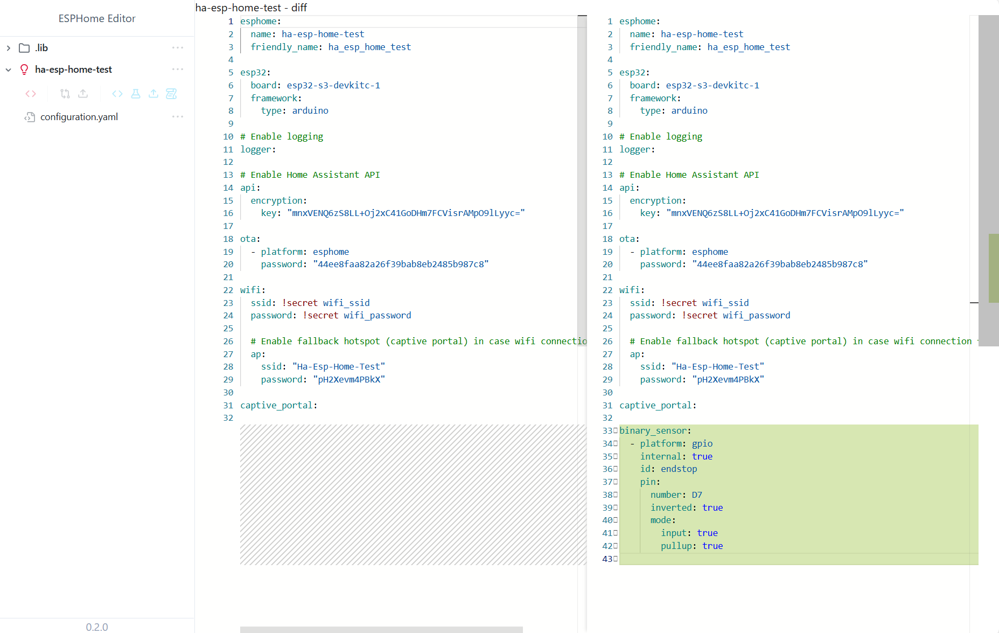

# Editor for ESPHome

Editor for ESPHome is a self-hosted, open-source, offline code editor built on top of [ESPHome](https://esphome.io/). It's designed to simplify the configuration of ESPHome devices by streamlining the process of writing and managing repetitive sections of your configuration YAML files.

This tool generates ESPHome YAML configurations through the following steps:

- Converts all `.eta` files ([etajs template](https://eta.js.org/)) to YAML.
- Combines all `.yaml` files into a final ESPHome YAML configuration.
- Uploads configuration to your ESPHome instance
- Compiles & OTA updates our device

See [Use Cases](/docs/code-samples.md) for more details.

<p align="center">
</img>
</p>

## Quick Start
Editor for ESPHome works as 
 - [standalone solution](#standalone) 
 - [Home Assistant add-on](https://github.com/Morcatko/ha-addons)
[](https://my.home-assistant.io/redirect/supervisor_add_addon_repository/?repository_url=https%3A%2F%2Fgithub.com%2FMorcatko%2Fha-addons)

<a name="standalone"></a>
If you only want to see how it works then run `docker run -d -p 8080:3000 morcatko/esphome-editor`. It will run Editor on port 8080 with some sample devices

Otherwise continue with following steps:

1. Prepare a folder to store your Editor device configurations (e.g., `/home/esphome-editor/devices`).

```yaml
# docker-compose.yaml
name: editor-for-esphome
services:
  editor-for-esphome:
    image: morcatko/esphome-editor:latest
    container_name: esphome-for-esphome
    environment:
      - ESPHOME_URL=__ESPHOME_URL__                               # e.g., ESPHOME_URL=http://192.168.0.99:6052
    ports:
      - __EXTERNAL_PORT__:3000                                    # e.g., 8080:3000
    volumes:
      - __path_to_editor_config__:/app/work-folder/devices        # e.g., /home/editor/devices:/app/work-folder/devices (!!! Not a path to ESPHome config files !!!)
```

2. Run the command:

```bash
docker compose up -d
```

### Limitations

Since this project is in an early stage, it has limited functionality and specific requirements:

- The ESPHome instance must be accessible without authentication (i.e., Home Assistant add-on is not supported).
- The Web UI does not support local file management.
- ESPHome devices cannot be created directly from the Editor.

See [Documentation](docs/index.md) for more info

## Roadmap (unordered)
- Tabs/multiple editors
- File management via Web UI
- Syntax/error highlighting
- YAML Patches
