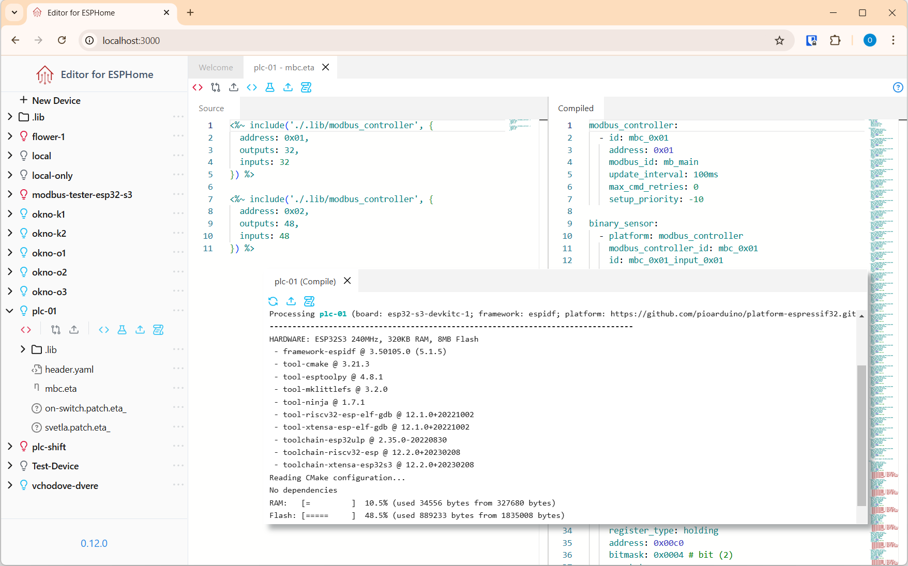

# Editor for ESPHome

Editor for ESPHome is a self-hosted, open-source, offline code editor built on top of [ESPHome](https://esphome.io/). It's designed to simplify the configuration of ESPHome devices by streamlining the process of writing and managing repetitive sections of your configuration YAML files.

See [Documentation](https://editor-4-esphome.github.io/) for more info and how to install

</img>

## Roadmap (unordered)
- File management via Web UI
- Syntax/error highlighting
- YAML Patches
- Versioning/Alternates
