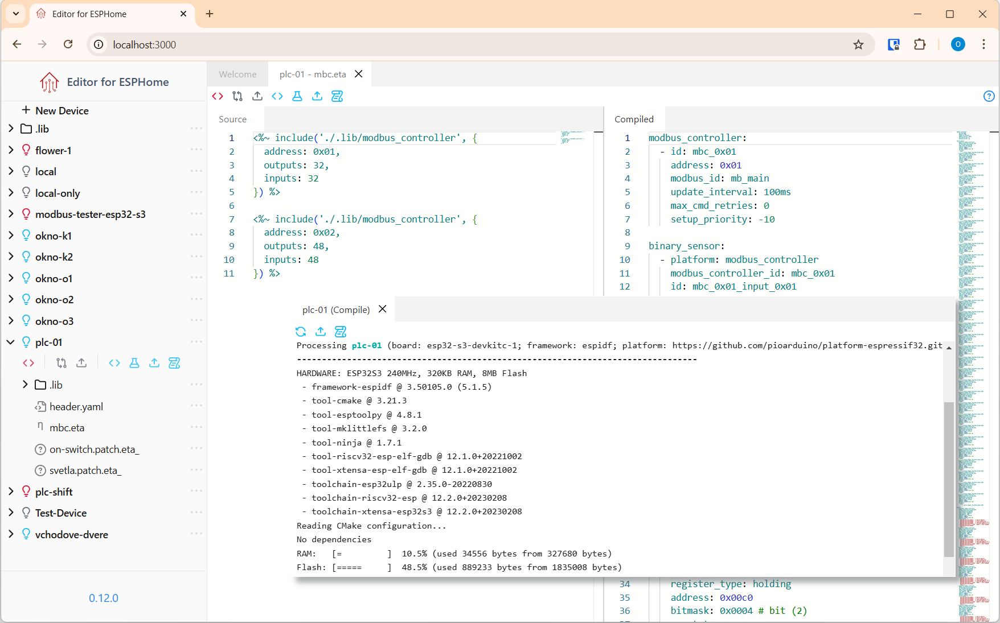

# UI Overview

import { BeakerIcon, CodeIcon, DownloadIcon, GitCompareIcon, LogIcon, UploadIcon } from "@primer/octicons-react";
import { color_local, color_gray, color_esphome } from "@site/../src/app/utils/const";

Once Editor for ESPHome is running, you'll be greeted with a clean and simple interface focused on managing and editing ESPHome device configurations.

Here’s a quick overview of the main parts of the UI:

## 📂 Sidebar – Device List

The sidebar on the left shows all devices currently stored in your editor's configuration folder and in ESPHome. From here, you can:

- View and switch between devices
- Add a new device
- Edit device configuration

## 📝 Editor Panel

The main area of the screen is the code editor. This is where you write or modify the configuration for the selected device.

Features include:

- Syntax highlighting for YAML
- Auto-indentation and smart formatting
- Quick navigation to ESPHome component documentation

## 🔧 Device Actions (Top Bar)

At the top of the editor, you’ll find actions specific to the currently selected device:

- <DownloadIcon fill={color_local} /> Import configuration from ESPHome instance  
- <CodeIcon fill={color_local} /> View the compiled local ESPHome configuration  
- <GitCompareIcon fill={color_gray} /> Compare local vs. ESPHome configuration  
- <UploadIcon fill={color_gray} /> Upload local configuration to ESPHome  
- <CodeIcon fill={color_esphome} /> View ESPHome configuration  
- <BeakerIcon fill={color_esphome} /> Compile ESPHome configuration  
- <UploadIcon fill={color_esphome} /> Install configuration to a device  
- <LogIcon fill={color_esphome} /> View log stream  

---

In the next section, we'll walk through creating your first device configuration from scratch.

