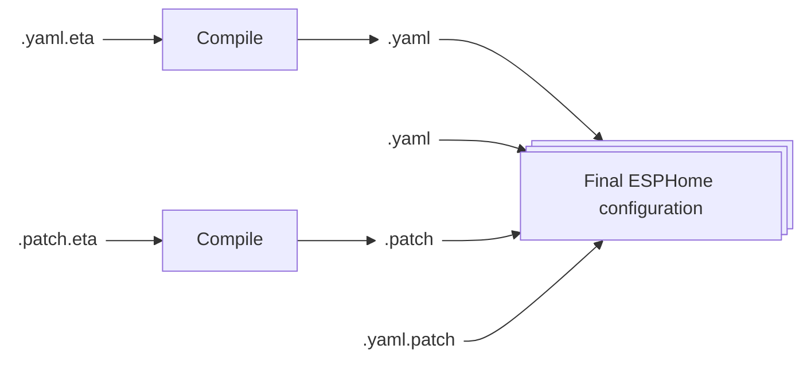

# Core Concepts

In **Editor for ESPHome**, the final device configuration is not written in a single YAML file. Instead, it’s dynamically assembled from multiple source and patch files.

This modular approach makes it easy to manage, reuse, and tweak parts of your device configuration — without repeating yourself.

---

### How Compilation Works

Editor for ESPHome does **not** compile or flash firmware itself. Instead, it:

1. **Assembles** your configuration files into a single YAML file
2. **Connects** to your existing **ESPHome Builder**
3. **Uploads** the generated YAML file to ESPHome

ESPHome then handles the actual compilation and firmware flashing, as usual.

---

### Step-by-Step Process

1. **Scan the Device Directory**  
   The editor scans the selected device folder for source files.

2. **Preprocess Source Files**  
   Files using template syntax (like `.eta.js`) are rendered into plain YAML.

3. **Merge into a Single YAML**  
   All processed files are combined into a single YAML configuration.

4. **Apply Patches**  
   The editor scans for any patch files, processes them, and applies them to the merged YAML to produce the final ESPHome-compatible configuration.

5. **Upload to ESPHome**  
   The final YAML is uploaded to your ESPHome Builder for compilation or flashing.

:::tip
You can [enable or disable individual files](./disable-file.md) to quickly test different configurations or features.
:::

---

---

Next up: Let’s look at how to structure a project.
